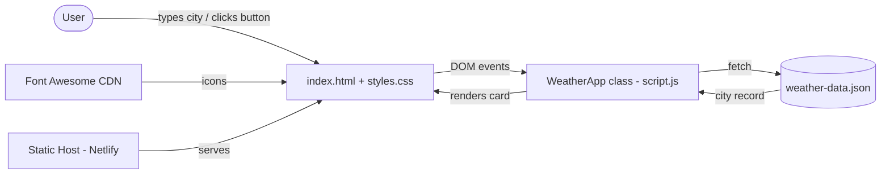

# Weather App (Basic) — Step-by-Step Build Guide

> **Archived: original build playbook.** This guide is the original roadmap used to build the Weather App (Basic). It documents, step by step, how the application was assembled from an empty folder into a working, responsive, accessible front-end app. The codebase may have evolved since this guide was written, so for the current setup, architecture, and deployment notes always refer to [../README.md](../README.md).

---

> **Project Summary:** Weather App (Basic) is a dependency-free, client-side weather viewer built with semantic HTML5, modern CSS3, and vanilla JavaScript (ES6+). It loads demo weather data from a local `weather-data.json` file via the Fetch API, so it runs without API keys. Users search a city by name or use one of eight quick-access buttons; the app renders temperature, "feels like", weather condition, wind, humidity, and visibility inside an animated, responsive card. The architecture is a single encapsulated `WeatherApp` class that handles data loading, event wiring, search, rendering, and error states. UI/UX leans on CSS variables for theming, Grid/Flexbox for layout, and keyframe animations for feedback. Security and accessibility are first-class: rendering uses `textContent` and safe DOM creation (no `innerHTML` injection of dynamic data), decorative icons are `aria-hidden`, the search input has an `aria-label`, and error messages use an `aria-live` alert region. Stack: HTML5, CSS3, Vanilla JavaScript (ES6+), Font Awesome, JSON.

Each step below is a self-contained prompt. Execute them in order.

Stack: HTML5, CSS3, Vanilla JavaScript (ES6+), Fetch API, Font Awesome 6.4.0, JSON, deployed as a static site (Netlify).

---

## Table of Contents

**PHASE 1 — Project Foundation**

- STEP 1 — Project Scaffolding & File Layout
- STEP 2 — Semantic HTML Structure

**PHASE 2 — Styling & Theme**

- STEP 3 — Design Tokens & Global Reset
- STEP 4 — Layout, Card & Responsive Rules

**PHASE 3 — Data & Application Core**

- STEP 5 — Demo Weather Data Model
- STEP 6 — The WeatherApp Class & Data Loading

**PHASE 4 — Interactivity & Features**

- STEP 7 — Search, Quick-Access Buttons & Rendering
- STEP 8 — Error Handling & Date/Time Formatting

**PHASE 5 — Polish & Deploy**

- STEP 9 — Accessibility & Security Hardening
- STEP 10 — Local Testing & Static Deployment

**Appendices**

- Appendix A — Shared Constants & Design Tokens
- Appendix B — Reusable Patterns
- Appendix C — Common Pitfalls
- Appendix D — Pre-Flight Checklist

---

## Global Build Rules (apply to EVERY step)

- **No git operations.** Do not run `git init`, `git add`, `git commit`, `git push`, or any other `git` command. Version control is handled manually by the user.
- Do not install unapproved packages. This project intentionally has **zero runtime dependencies**; Font Awesome is loaded via CDN.
- Do not run long-running processes (watchers, servers) unless the user explicitly requests it. A static server is only needed for manual testing.
- Treat every step as self-contained: it states its goal, the files it touches, the implementation notes, and an acceptance checklist.
- Prefer modern, native JavaScript (ES6+ classes, `async/await`, arrow functions, template literals) over libraries.
- Keep code clean, readable, and DRY. Use descriptive English identifiers in `camelCase`.
- Prioritize accessibility (a11y), security, and performance in every UI decision.

---

## Architecture at a Glance

The app is fully client-side. There is no backend or database; "data" is a static JSON file served alongside the static assets.



- **`index.html`** — semantic structure: header, search box, error region, weather card, and quick-access button container.
- **`styles.css`** — design tokens (CSS variables), layout (Grid/Flexbox), animations, and responsive breakpoints.
- **`script.js`** — the `WeatherApp` class: data loading, event listeners, search, rendering, and error handling.
- **`weather-data.json`** — demo dataset keyed by lowercase city name.
- **Font Awesome (CDN)** — decorative weather and UI icons.
- **Static host (Netlify)** — serves the files; no server-side logic is required.

---

# PHASE 1 — PROJECT FOUNDATION

---

## STEP 1 — Project Scaffolding & File Layout

**Goal:** Create the minimal flat file structure for a static front-end app.

**Files/folders to create:**

```
weather-app-basic/
├── index.html          # markup
├── styles.css          # styles
├── script.js           # app logic
├── weather-data.json   # demo data
├── README.md           # documentation
└── docs/
    └── build-guide.md  # this guide
```

**Implementation notes:**

- No build tooling, bundler, or `package.json` is required. The app runs directly in the browser.
- Keep everything at the project root except documentation, which lives under `docs/`.

**Acceptance checklist:**

- [ ] All five core files exist at the root.
- [ ] Opening `index.html` in a browser loads without 404s (icons may need network for the CDN).

---

## STEP 2 — Semantic HTML Structure

**Goal:** Build accessible, semantic markup that the CSS and JS will hook into.

**Files to edit:** `index.html`

**Implementation notes:**

- Set `<html lang="en">`, charset `UTF-8`, and a responsive viewport meta.
- Link `styles.css` and the Font Awesome 6.4.0 CDN stylesheet in `<head>`.
- Provide stable element IDs the JS will query: `cityInput`, `searchBtn`, `errorMessage`, `weatherCard`, `cityName`, `dateTime`, `weatherIcon`, `temperature`, `description`, `windSpeed`, `humidity`, `feelsLike`, `visibility`, and `cityButtons`.
- Mark the error container with `role="alert"` and `aria-live="assertive"`.
- Give the search input an `aria-label` and the icon-only search button an `aria-label`.
- Add `aria-hidden="true"` to all decorative `<i>` icons.
- Load `script.js` at the end of `<body>` (deferred execution via DOM order).

**Acceptance checklist:**

- [ ] All required IDs are present and unique.
- [ ] The weather card starts hidden (`class="weather-card hidden"`).
- [ ] No accessibility warnings for unlabeled controls.

---

# PHASE 2 — STYLING & THEME

---

## STEP 3 — Design Tokens & Global Reset

**Goal:** Establish a themeable foundation with CSS variables and a consistent box model.

**Files to edit:** `styles.css`

**Implementation notes:**

- Apply a universal reset: `margin: 0; padding: 0; box-sizing: border-box;`.
- Define design tokens in `:root` (see Appendix A): primary/secondary colors, background gradient, card background, text colors, shadows, border radius, and transition timing.
- Use a gradient background and center the app with Flexbox on `body`.

**Acceptance checklist:**

- [ ] Changing a single `:root` variable updates the theme app-wide.
- [ ] The layout is vertically and horizontally centered.

---

## STEP 4 — Layout, Card & Responsive Rules

**Goal:** Style the search box, weather card, detail grid, and quick-access buttons, then make it responsive.

**Files to edit:** `styles.css`

**Implementation notes:**

- Constrain the container to `max-width: 500px` and add a `fadeIn` entrance animation.
- Style the weather details as a two-column CSS Grid (`repeat(2, 1fr)`).
- Add keyframe animations: `fadeIn`, `slideUp` (card entrance), and `shake` (error feedback).
- Add a `@media (max-width: 600px)` breakpoint that collapses the detail grid to a single column and scales typography down.
- Use `:hover`, `:active`, and `:focus-within` states for interactive feedback.

**Acceptance checklist:**

- [ ] On screens ≤ 600px the detail grid becomes one column.
- [ ] The card animates in when revealed.
- [ ] Hover/focus states are visible on the search box and buttons.

---

# PHASE 3 — DATA & APPLICATION CORE

---

## STEP 5 — Demo Weather Data Model

**Goal:** Define the static dataset the app reads instead of a live API.

**Files to edit:** `weather-data.json`

**Implementation notes:**

- Top-level shape: `{ "cities": { "<lowercase city key>": { ...record } } }`.
- Each city record contains: `name`, `temperature`, `feelsLike`, `description`, `icon` (a Font Awesome class such as `fa-sun`), `windSpeed`, `humidity`, and `visibility`.
- Keys are lowercase to match the normalized search input.
- Seed eight cities: New York, London, Tokyo, Paris, Berlin, Sydney, Dubai, Mumbai.

**Acceptance checklist:**

- [ ] JSON is valid (no trailing commas).
- [ ] Every record has all eight fields.
- [ ] Keys are lowercase.

---

## STEP 6 — The WeatherApp Class & Data Loading

**Goal:** Create the application controller and load data asynchronously.

**Files to edit:** `script.js`

**Implementation notes:**

- Define a `WeatherApp` class with `weatherData` and `currentCity` state.
- In the constructor, call an `async init()` that awaits `loadWeatherData()`, then wires events and renders the quick-access buttons.
- `loadWeatherData()` uses `fetch('weather-data.json')` inside `try/catch`; on failure it surfaces a user-facing error.
- Instantiate the app on `DOMContentLoaded`.

```javascript
class WeatherApp {
    constructor() {
        this.weatherData = null;
        this.currentCity = null;
        this.init();
    }

    async init() {
        await this.loadWeatherData();
        this.setupEventListeners();
        this.renderCityButtons();
    }

    async loadWeatherData() {
        try {
            const response = await fetch('weather-data.json');
            this.weatherData = await response.json();
        } catch (error) {
            console.error('Failed to load weather data:', error);
            this.showError('An error occurred while loading data.');
        }
    }
}

document.addEventListener('DOMContentLoaded', () => new WeatherApp());
```

**Acceptance checklist:**

- [ ] `weatherData` is populated after load (served over HTTP, not `file://`).
- [ ] A failed fetch shows a friendly error instead of crashing.

---

# PHASE 4 — INTERACTIVITY & FEATURES

---

## STEP 7 — Search, Quick-Access Buttons & Rendering

**Goal:** Let users find a city and render its weather safely.

**Files to edit:** `script.js`

**Implementation notes:**

- `setupEventListeners()` binds the search button click, the Enter keypress on the input, and an `input` listener that clears errors as the user types.
- `handleSearch()` trims and lowercases input, validates non-empty, then calls `searchCity()`.
- `searchCity(cityName)` looks up `this.weatherData.cities[cityName]`; if missing, show an error; if found, call `displayWeather()`.
- `displayWeather(cityData)` updates each field with `textContent` (never `innerHTML` for data) and rebuilds the icon via a `createIcon()` helper.
- `renderCityButtons()` builds buttons with `createElement` + `textContent` + `replaceChildren()`, capturing the city key in a closure for the click handler (avoids `data-*` + `e.target` fragility).

```javascript
createIcon(iconClass) {
    const icon = document.createElement('i');
    icon.className = `fas ${iconClass}`;
    icon.setAttribute('aria-hidden', 'true');
    return icon;
}
```

**Acceptance checklist:**

- [ ] Searching a known city renders the card with all fields.
- [ ] Quick-access buttons render and trigger searches.
- [ ] No dynamic value is injected via `innerHTML`.

---

## STEP 8 — Error Handling & Date/Time Formatting

**Goal:** Provide clear feedback and an accurate timestamp.

**Files to edit:** `script.js`

**Implementation notes:**

- `showError(message)` / `hideError()` toggle a `show` class on the alert region.
- Errors cover: empty input, data not yet loaded, and unknown city.
- `getCurrentDateTime()` formats with `toLocaleString('en-US', options)` — not `toLocaleDateString`, which silently drops the `hour`/`minute` options. This ensures both date and time render.

```javascript
getCurrentDateTime() {
    const now = new Date();
    const options = {
        weekday: 'long', year: 'numeric', month: 'long',
        day: 'numeric', hour: '2-digit', minute: '2-digit'
    };
    // toLocaleString honors the time options; toLocaleDateString would drop them.
    return now.toLocaleString('en-US', options);
}
```

**Acceptance checklist:**

- [ ] An unknown city shows a descriptive error.
- [ ] The displayed timestamp includes both date and time.

---

# PHASE 5 — POLISH & DEPLOY

---

## STEP 9 — Accessibility & Security Hardening

**Goal:** Make the app screen-reader friendly and resistant to injection.

**Files to edit:** `index.html`, `script.js`

**Implementation notes:**

- Error region: `role="alert"` + `aria-live="assertive"` so updates are announced.
- Search input: `aria-label="City name"`; icon-only button: `aria-label="Search"`.
- Decorative icons: `aria-hidden="true"`; JS-created icons also set it via `createIcon()`.
- Buttons use `type="button"` to avoid implicit form submission.
- Security: all dynamic text uses `textContent`; lists are built with DOM APIs, so city names cannot be interpreted as HTML.

**Acceptance checklist:**

- [ ] Keyboard-only navigation can search and read results.
- [ ] No `innerHTML` is used for any externally sourced string.

---

## STEP 10 — Local Testing & Static Deployment

**Goal:** Verify locally and ship as a static site.

**Implementation notes:**

- `fetch` requires HTTP(S); serve locally rather than opening via `file://`:

```bash
# Python 3
python -m http.server 8000
# or Node
npx http-server -p 8000
```

- Deploy by uploading the static files to any static host (the live demo uses Netlify). No build step or environment variables are needed.

**Acceptance checklist:**

- [ ] Visiting `http://localhost:8000` loads data and renders cities.
- [ ] The deployed URL works the same as local.

---

# Appendix A — Shared Constants & Design Tokens

Defined once in `:root` and reused everywhere:

```css
:root {
    --primary-color: #4a90e2;
    --secondary-color: #50c878;
    --background-gradient: linear-gradient(135deg, #667eea 0%, #764ba2 100%);
    --card-background: rgba(255, 255, 255, 0.95);
    --text-primary: #2c3e50;
    --text-secondary: #7f8c8d;
    --shadow: 0 10px 30px rgba(0, 0, 0, 0.2);
    --shadow-hover: 0 15px 40px rgba(0, 0, 0, 0.3);
    --border-radius: 20px;
    --transition: all 0.3s ease;
}
```

Supported weather icons (Font Awesome): `fa-sun`, `fa-cloud`, `fa-cloud-sun`, `fa-cloud-rain`, `fa-snowflake`, `fa-bolt`.

---

# Appendix B — Reusable Patterns

- **Safe DOM rendering:** prefer `element.textContent = value` and `createElement` + `replaceChildren()` over `innerHTML` for any dynamic data.
- **Closure over loop variable:** capture the current `cityKey` inside the event handler instead of reading it back from `data-*` attributes.
- **Single source of theming:** all colors, shadows, and timings come from `:root` variables.
- **Class-based encapsulation:** all state and behavior live inside `WeatherApp`; the only global is the `DOMContentLoaded` bootstrap.

---

# Appendix C — Common Pitfalls

- **Opening via `file://`:** `fetch('weather-data.json')` fails under the file protocol. Always serve over HTTP for local testing.
- **`toLocaleDateString` dropping time:** it ignores `hour`/`minute` options. Use `toLocaleString` when you need the time.
- **City key casing:** JSON keys are lowercase; the search must lowercase input before lookup.
- **Redundant icon classes:** Font Awesome renders through the inner `<i>`; do not also stack the icon class on the parent container.
- **`innerHTML` with dynamic data:** introduces XSS risk; use `textContent`/DOM APIs.

---

# Appendix D — Pre-Flight Checklist

- [ ] All element IDs referenced in `script.js` exist in `index.html`.
- [ ] `weather-data.json` is valid and keys are lowercase.
- [ ] App is served over HTTP during testing.
- [ ] Search works for known cities and shows errors for unknown ones.
- [ ] Quick-access buttons render and function.
- [ ] Date and time both display correctly.
- [ ] Decorative icons are `aria-hidden`; inputs/buttons are labeled.
- [ ] No `innerHTML` injection of dynamic values.
- [ ] Layout is responsive at ≤ 600px.
